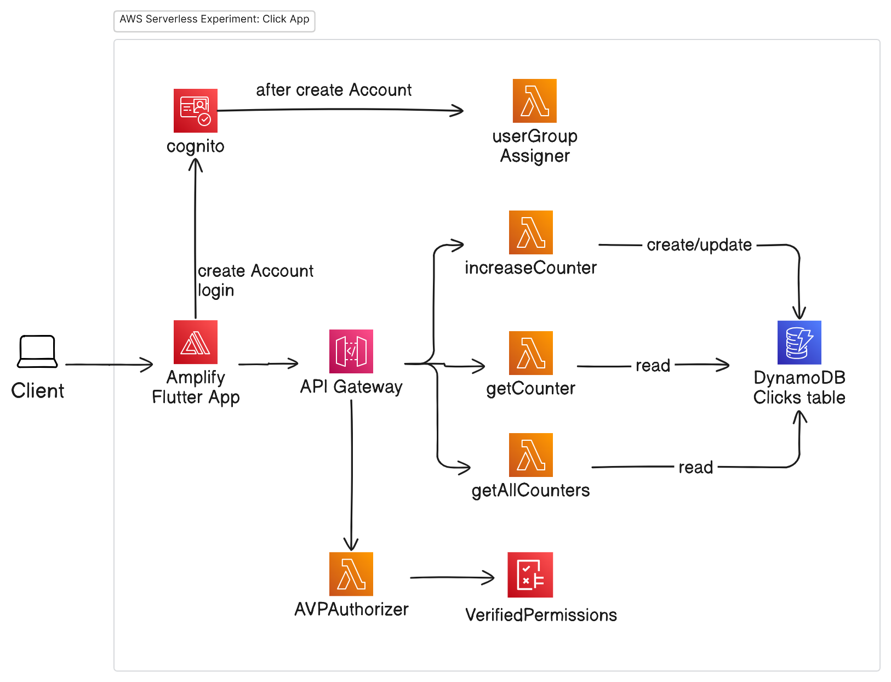
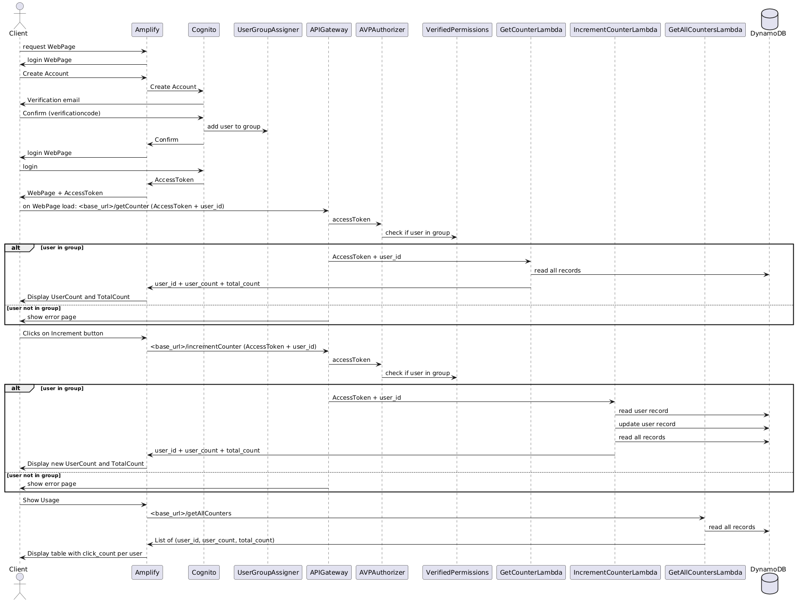

# Flutter frontend for KLiK app

This project is created to experiment with an AWS serverless backend and Flutter frontend.
The AWS Lambdas used for the project can be viewed at:

https://github.com/edwinbulter/klik_backend

A working example of this Flutter frontend can be watched at:
https://main.dv7o5mle7kpe3.amplifyapp.com/

## AWS Components:

## Sequence Diagram:

